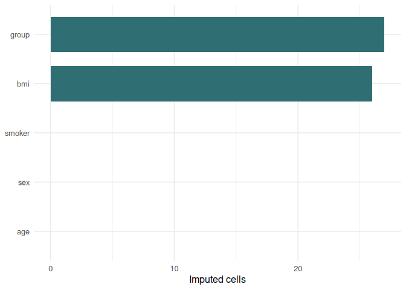
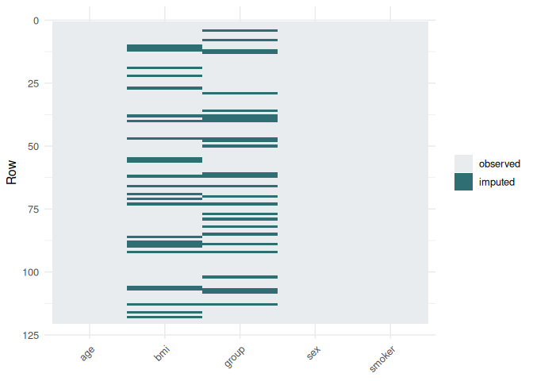
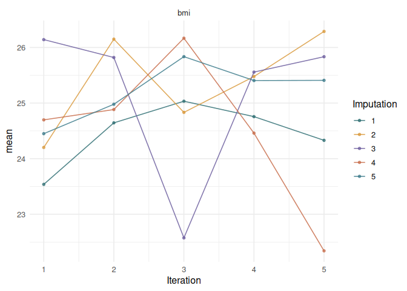
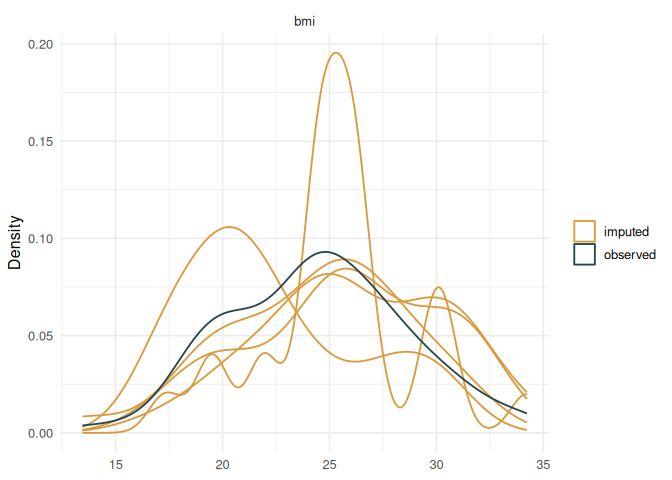
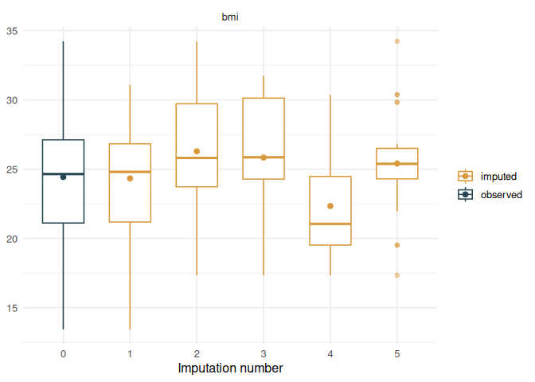
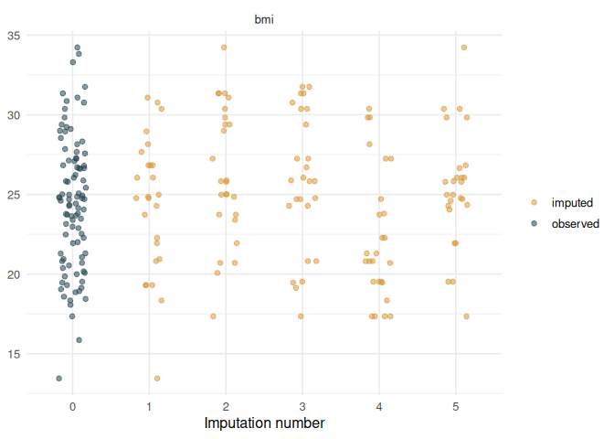
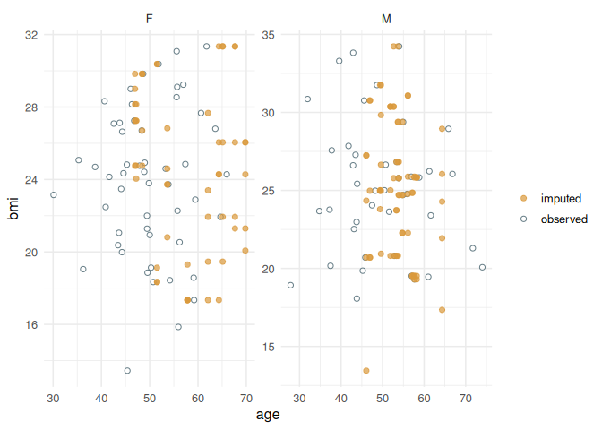
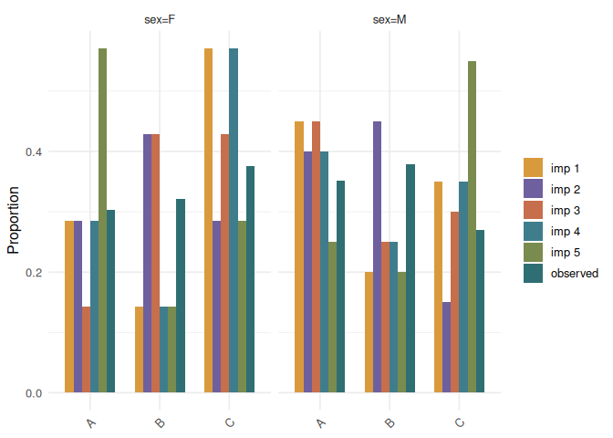

# mimar

`mimar` implements a compact chained-imputation workflow in R for
missing-data analysis, artificial amputation, native and learner-backed
single and multiple imputation, diagnostic evaluation, and
post-imputation pooling.

The package is built around a complete missing-data workflow: describe
the missingness, create benchmark amputations when needed, impute with
native or learner-backed update rules, inspect diagnostics, evaluate
recovered cells when truth is available, and pool post-fit quantities.
The goal is a concise grammar for the whole workflow, not a replacement
for every specialist feature in larger imputation systems.

The package owns the imputation loop. Every imputer, whether implemented
natively or backed by a learner package, is called the same way:

``` r
impute(data, imputer = "pmm", m = 5, maxit = 5, seed = 1)
impute(data, imputer = "rf", m = 5, seed = 1)
impute(data, imputer = "xgboost", m = 5, seed = 1)
```

There is no dependency on `funcml`. Learner-backed imputers call their
original packages directly, and those backend packages are hard
dependencies so users can run any registered imputer without manually
resolving learner installations.

## Installation

Install the development version from GitHub:

``` r
install.packages("remotes")
remotes::install_github("ielbadisy/mimar")
```

Then load the package:

``` r
library(mimar)
```

## Succinct Use

For normal use, `impute()` is the only function you need. The input data
can contain `NA`, and the completed outputs returned by `complete()` do
not.

``` r
i <- impute(a, imputer = "knn", m = 5, maxit = 5, seed = 1)
complete(i, 1)
complete(i, "all")
```

## Grammar

``` r
describe()
ampute()
imputer_registry()
imputer()
impute()
complete()
evaluate()
pool()
plot()
```

## Quick Example

``` r
library(mimar)

set.seed(1)
dat <- data.frame(
  age = rnorm(120, 50, 10),
  bmi = rnorm(120, 25, 4),
  sex = factor(sample(c("F", "M"), 120, TRUE)),
  group = factor(sample(c("A", "B", "C"), 120, TRUE)),
  smoker = sample(c(TRUE, FALSE), 120, TRUE)
)

a <- ampute(
  dat,
  prop = 0.25,
  mechanism = "MAR",
  target = c("bmi", "group"),
  by = c("age", "sex"),
  seed = 1
)

i <- impute(a, imputer = "knn", m = 5, maxit = 5, seed = 1, ncore = 2)
complete(i, 1)
```

    ## # A tibble: 120 × 5
    ##      age   bmi sex   group smoker
    ##    <dbl> <dbl> <fct> <fct> <lgl> 
    ##  1  43.7  23.0 M     C     FALSE 
    ##  2  51.8  30.4 F     A     FALSE 
    ##  3  41.6  24.1 F     B     TRUE  
    ##  4  66.0  24.3 F     C     TRUE  
    ##  5  53.3  24.6 F     A     FALSE 
    ##  6  41.8  27.9 M     C     TRUE  
    ##  7  54.9  24.7 M     B     TRUE  
    ##  8  57.4  24.8 F     B     FALSE 
    ##  9  55.8  22.3 F     B     FALSE 
    ## 10  46.9  30.8 M     A     FALSE 
    ## # ℹ 110 more rows

``` r
summary(i)
```

    ## mimar imputation summary
    ## # A tibble: 1 × 11
    ##    rows columns n_imputations imputer maxit ncore stochastic
    ##   <int>   <int>         <int> <chr>   <dbl> <int> <lgl>     
    ## 1   120       5             5 knn         5     2 TRUE      
    ## # ℹ 4 more variables: total_missing_before <int>, total_imputed <int>,
    ## #   remaining_missing <int>, variables_imputed <int>
    ## 
    ## Variables:
    ## # A tibble: 5 × 9
    ##   variable type    method n_missing_before prop_missing_before n_imputed
    ##   <chr>    <chr>   <chr>             <int>               <dbl>     <int>
    ## 1 age      numeric none                  0               0             0
    ## 2 bmi      numeric knn                  26               0.217        26
    ## 3 sex      factor  none                  0               0             0
    ## 4 group    factor  knn                  27               0.225        27
    ## 5 smoker   logical none                  0               0             0
    ## # ℹ 3 more variables: prop_imputed <dbl>, remaining_missing <int>,
    ## #   between_imputation_sd <dbl>

``` r
evaluate(i)
```

    ## mimar imputation evaluation
    ## # A tibble: 1 × 4
    ##   n_imputations imputer total_missing evaluated_cells
    ##           <int> <chr>           <int>           <int>
    ## 1             5 knn                53              53

``` r
plot(i, type = "density")
```

<!-- -->

## Imputers

Inspect available imputers with:

``` r
imputer_registry()
```

    ## # A tibble: 23 × 10
    ##    imputer implementation package  supports_numeric supports_binary
    ##    <chr>   <chr>          <chr>    <lgl>            <lgl>          
    ##  1 mean    mimar          internal TRUE             TRUE           
    ##  2 median  mimar          internal TRUE             TRUE           
    ##  3 mode    mimar          internal TRUE             TRUE           
    ##  4 naive   mimar          internal TRUE             TRUE           
    ##  5 norm    mimar          internal TRUE             TRUE           
    ##  6 pmm     mimar          internal TRUE             TRUE           
    ##  7 spmm    mimar          internal TRUE             TRUE           
    ##  8 logreg  mimar          internal TRUE             TRUE           
    ##  9 polyreg mimar          internal TRUE             TRUE           
    ## 10 rf      wrapped        ranger   TRUE             TRUE           
    ## # ℹ 13 more rows
    ## # ℹ 5 more variables: supports_multiclass <lgl>, stochastic <lgl>,
    ## #   description <chr>, available <lgl>, status <chr>

``` r
describe("imputers")
```

    ## mimar available imputers
    ## # A tibble: 23 × 10
    ##    imputer implementation package  supports_numeric supports_binary
    ##    <chr>   <chr>          <chr>    <lgl>            <lgl>          
    ##  1 mean    mimar          internal TRUE             TRUE           
    ##  2 median  mimar          internal TRUE             TRUE           
    ##  3 mode    mimar          internal TRUE             TRUE           
    ##  4 naive   mimar          internal TRUE             TRUE           
    ##  5 norm    mimar          internal TRUE             TRUE           
    ##  6 pmm     mimar          internal TRUE             TRUE           
    ##  7 spmm    mimar          internal TRUE             TRUE           
    ##  8 logreg  mimar          internal TRUE             TRUE           
    ##  9 polyreg mimar          internal TRUE             TRUE           
    ## 10 rf      wrapped        ranger   TRUE             TRUE           
    ## # ℹ 13 more rows
    ## # ℹ 5 more variables: supports_multiclass <lgl>, stochastic <lgl>,
    ## #   description <chr>, available <lgl>, status <chr>

Core native imputers:

- `mean`, `median`, `mode`
- `naive`: median/mode chained baseline
- `norm`: linear normal draw
- `pmm`, `spmm`: predictive mean matching
- `logreg`: binary logistic regression draw
- `polyreg`: one-vs-rest multinomial draw
- `knn`: nearest-neighbor donor imputation
- `hotdeck`: stochastic donor imputation

Learner-backed imputers:

- `rf`: MissForest-style chained random forest imputer through `ranger`
- `ranger`: random forest through `ranger`
- `rpart`: tree imputer through `rpart`
- `nbayes`: naive Bayes through `naivebayes`
- `svm`: support vector machine through `e1071`
- `bart`: Bayesian additive regression trees through `BART`
- `glmnet`: penalized regression through `glmnet`
- `gbm`: gradient boosting through `gbm`
- `xgboost`: gradient boosted trees through `xgboost`
- `famd`: FAMD-assisted donor imputation through `missMDA`
- `superlearner`, `sl`: cross-validated Super Learner-style ensemble
  imputer

Imputer names are strict: use the names shown by `imputer_registry()`.
Learner-backed imputers are applied as requested to numeric, binary, and
multiclass targets; `mimar` does not silently swap them for another
imputer inside benchmark runs.

## Parallel Imputation

The `ncore` argument runs independent completed datasets in parallel.
The parallel boundary is the outer imputation index: each completed
dataset gets a deterministic seed offset, so a fixed `seed`, `m`,
`maxit`, and imputer remain reproducible.

``` r
i <- impute(a, imputer = "knn", m = 5, maxit = 5, seed = 1, ncore = 2)
```

Use `ncore = 1` for sequential execution, small examples, and the most
conservative behavior in constrained environments.

## Tuning Imputers

Learner-backed imputers expose their hyperparameters through `imputer()`
or directly through `...` in `impute()`. Donor-based imputers use the
explicit `donors` argument.

``` r
rf_spec <- imputer("rf", num.trees = 500)
xgb_spec <- imputer("xgboost", nrounds = 100, max_depth = 3)

i1 <- impute(a, imputer = rf_spec, m = 5, maxit = 5, seed = 1)
i2 <- impute(a, imputer = "xgboost", m = 5, maxit = 5, seed = 1,
             nrounds = 100, max_depth = 3)
i3 <- impute(a, imputer = "knn", m = 5, maxit = 5, seed = 1, donors = 10)
```

The same hyperparameter set is reused across all incomplete variables
that a given imputer supports, which keeps the full chained-imputation
pipeline reproducible and easy to tune.

## Super Learner Imputation

`superlearner` combines candidate imputers by cross-validating them on
observed cells, assigning non-negative loss-based weights, and using the
weighted ensemble inside the chained-imputation loop.

``` r
sl <- imputer(
  "superlearner",
  library = c("pmm", "knn", "rpart"),
  folds = 5,
  metalearner = "inverse_loss"
)

i_sl <- impute(a, imputer = sl, m = 5, maxit = 5, seed = 1)
```

The short alias `imputer = "sl"` is equivalent to
`imputer = "superlearner"`.

## Diagnostic Plots

`plot()` methods return `ggplot` objects. For `mimar_imputation`
objects, the main diagnostic types are:

``` r
plot(i)                                      # imputed cell counts
```

<!-- -->

``` r
plot(i, type = "missing")                   # observed/imputed cell map
```

<!-- -->

``` r
plot(i, type = "trace", statistic = "mean") # convergence-screening trace
```

<!-- -->

``` r
plot(i, type = "density", variable = "bmi") # line-only density overlays
```

<!-- -->

``` r
plot(i, type = "boxplot", variable = "bmi") # observed vs imputation 1:m
```

<!-- -->

``` r
plot(i, type = "strip", variable = "bmi")   # individual values by imputation
```

<!-- -->

Formula diagnostics are available for bivariate and categorical checks:

``` r
plot(i, type = "xy", formula = bmi ~ age | sex)
```

<!-- -->

``` r
plot(i, type = "proportion", formula = group ~ sex)
```

<!-- -->

For `type = "xy"`, formulas use `y ~ x` or `y ~ x | group`. For
`type = "proportion"`, formulas use `categorical_variable ~ strata`.
Density diagnostics use line-only overlays so several imputations remain
visible rather than obscuring each other with filled areas.

## Chained Imputation Model

Let `X` be an `n x p` data frame and let `R_ij = 1` when cell `(i, j)`
is missing. For each incomplete variable `X_j`:

- `O_j = {i : R_ij = 0}` are the observed rows
- `M_j = {i : R_ij = 1}` are the missing rows

At each chained update, `mimar` fits an imputer-specific model from the
observed rows and then predicts the missing rows from the current
completed data. In compact form:

``` text
fit model on X_-j, O_j -> X_j, O_j
update X_j, M_j using the fitted model
```

Multiple imputation repeats the same chained procedure `m` times with
controlled seeds, bootstrap samples of observed rows, and stochastic
prediction where supported.

Learner-backed imputers are practical stochastic update rules inside
this chained workflow. They can improve predictive recovery, but users
should still inspect trace, distribution, categorical-proportion, and
downstream sensitivity diagnostics rather than assuming every learner
automatically supplies proper multiple-imputation uncertainty for every
analysis.

## Algorithm

``` text
Input: X, R, h, m, T
Initialize: X~(0) <- init(X)
For k = 1,...,m:
  X~_k(0) <- X~(0)
  For t = 1,...,T:
    For each incomplete variable j:
      B_j <- bootstrap sample of O_j
      fit h on X~_k, B_j, -j and X_Bj,j
      update missing rows M_j using the fitted model
      restore observed rows O_j to their original values
Return: {X~_1(T), ..., X~_m(T)}
```

## Evaluation and Pooling

When imputation is run on an `ampute()` object, `evaluate()` uses the
retained truth and scores only artificially removed cells. Numeric
recovery reports RMSE, MAE, bias, and correlation. Categorical recovery
reports accuracy and balanced accuracy.

`pool()` combines post-fit quantities estimated separately in each
completed dataset. The statistical target is the quantity itself, not a
data frame. A quantity can be a scalar, coefficient vector,
covariance-aware parameter vector, matrix of survival probabilities, or
a scalar metric. Data frames are accepted only as a tidy adapter for
scalar model output.

For scalar quantities with complete-data variance estimates, `pool()`
applies Rubin-style pooling:

``` text
Q_bar = mean(Q_k)
U_bar = mean(U_k)
B     = sample variance of Q_k
T     = U_bar + (1 + 1/m) * B
```

``` r
results <- data.frame(
  term = rep(c("age", "bmi"), each = 3),
  estimate = c(0.10, 0.11, 0.09, 0.30, 0.32, 0.29),
  std.error = c(0.04, 0.05, 0.04, 0.08, 0.09, 0.08),
  imputation = rep(1:3, times = 2)
)

pool(results)
```

    ## mimar pooled results
    ## # A tibble: 2 × 14
    ##   term  estimate std.error statistic    df  p.value conf.low conf.high     m
    ##   <chr>    <dbl>     <dbl>     <dbl> <dbl>    <dbl>    <dbl>     <dbl> <int>
    ## 1 age      0.1      0.0451      2.22  465. 0.0271     0.0114     0.189     3
    ## 2 bmi      0.303    0.0853      3.56 1094. 0.000393   0.136      0.471     3
    ## # ℹ 5 more variables: within_variance <dbl>, between_variance <dbl>,
    ## #   total_variance <dbl>, relative_increase_variance <dbl>, rule <chr>

Direct quantity inputs are preferred when available:

``` r
pool(c(0.10, 0.11, 0.09), std.error = c(0.04, 0.05, 0.04), name = "age")
```

    ## mimar pooled results
    ## # A tibble: 1 × 14
    ##   term  estimate std.error statistic    df p.value conf.low conf.high     m
    ##   <chr>    <dbl>     <dbl>     <dbl> <dbl>   <dbl>    <dbl>     <dbl> <int>
    ## 1 age        0.1    0.0451      2.22  465.  0.0271   0.0114     0.189     3
    ## # ℹ 5 more variables: within_variance <dbl>, between_variance <dbl>,
    ## #   total_variance <dbl>, relative_increase_variance <dbl>, rule <chr>

``` r
betas <- list(
  c(age = 0.10, bmi = 0.30),
  c(age = 0.11, bmi = 0.32),
  c(age = 0.09, bmi = 0.29)
)
covariances <- list(
  diag(c(0.04, 0.08)^2),
  diag(c(0.05, 0.09)^2),
  diag(c(0.04, 0.08)^2)
)
pool(betas, covariance = covariances)
```

    ## mimar pooled results
    ## # A tibble: 2 × 14
    ##   term  estimate std.error statistic    df  p.value conf.low conf.high     m
    ##   <chr>    <dbl>     <dbl>     <dbl> <dbl>    <dbl>    <dbl>     <dbl> <int>
    ## 1 age      0.1      0.0451      2.22  465. 0.0271     0.0114     0.189     3
    ## 2 bmi      0.303    0.0853      3.56 1094. 0.000393   0.136      0.471     3
    ## # ℹ 5 more variables: within_variance <dbl>, between_variance <dbl>,
    ## #   total_variance <dbl>, relative_increase_variance <dbl>, rule <chr>

When no reliable complete-data variance is supplied, as is common for
some performance metrics, `pool()` reports robust summaries by default:
median, interquartile range, and range across imputations.

## Installation notes

Learner backends are hard dependencies. Installing `mimar` installs the
packages needed by the registered learner-backed imputers, including
`ranger`, `rpart`, `naivebayes`, `e1071`, `BART`, `glmnet`, `gbm`,
`xgboost`, and `missMDA`.
